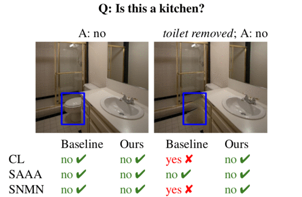

Vedika Agarwal, [Rakshith Shetty](https://www.mpi-inf.mpg.de/departments/computer-vision-and-machine-learning/people/rakshith-shetty/), [Mario Fritz](https://scalable.mpi-inf.mpg.de/)
{: style="font-size: 120%; text-align: center;"}

{:refdef: style="text-align: center;"}
{:width="90%"}
{: refdef}

Abstract
==================
*Despite significant success in Visual Question Answering (VQA), VQA models have been shown to be notoriously brittle to linguistic variations in the questions. Due to deficiencies in models and datasets, today's models often rely on correlations rather than predictions that are causal w.r.t. data.
In this paper, we propose a novel way to analyze and measure the robustness of the state of the art models w.r.t semantic visual variations as well as propose ways to make models more robust against spurious correlations.
Our method performs automated semantic image manipulations and tests for consistency in model predictions to quantify the model robustness as well as generate synthetic data to counter these problems.
We perform our analysis on three diverse, state of the art VQA models and diverse question types with a particular focus on challenging counting questions. In addition, we show that models can be made significantly more robust against inconsistent predictions using our edited data. Finally, we show that results also translate to real-world error cases of state of the art models, which results in improved overall performance.*
{: style="font-size: 110%; text-align: left;"}

# Dataset

## Invariant-VQA (IV-VQA)

| Dowload links | Description |
|:--------|:-------|
| [Train Images](https://datasets.d2.mpi-inf.mpg.de/rakshith/causalvqa/rawdata/train2014_edited.tar.gz) | Edited training images from VQA-V2 dataset with one irrelevant object removed. There are multiple versions of each original image, with different object removed in each variant|
| [Validation Images](https://datasets.d2.mpi-inf.mpg.de/rakshith/causalvqa/rawdata/val2014_edited.tar.gz) | Edited validation images from VQA-V2 dataset with one irrelevant object removed |
| [Annotations](https://datasets.d2.mpi-inf.mpg.de/rakshith/causalvqa/rawdata/annotations_0.1_0.1.tar.gz) | With size-filter =10%, overlap=10% |
|=====
{: rules="groups"}

## CoVariant-VQA (CV-VQA)

| Split   | Description |
|:--------|:-------|
| [Train Images](https://datasets.d2.mpi-inf.mpg.de/rakshith/causalvqa/rawdata/CV_VQA_train2014.tar.gz) | Counting related training images with one instance of the target object class removed |
| [Validation Images](https://datasets.d2.mpi-inf.mpg.de/rakshith/causalvqa/rawdata/CV_VQA_val2014.tar.gz)| Same as above for the validation set|
| [Annotations](https://datasets.d2.mpi-inf.mpg.de/rakshith/causalvqa/rawdata/CV_VQA_annotations_0.1_0.0.tar.gz)| With size-filter =10%, overlap=0%|
